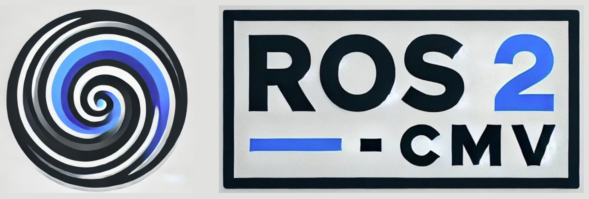
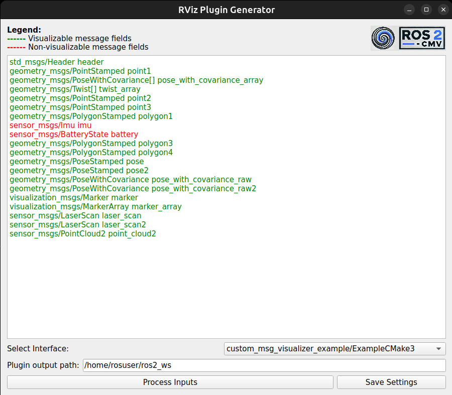
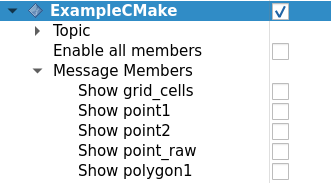

<div align="center">
  
</div>
<br>
ROS 2 - CMV (ROS 2 - Custom message visualizer) is a library that can be used to generate RViz plugins for your custom messages. 

The plugins can be generated either with a GUI interface provided or by simply calling a CMake macro in your CMakeLists.txt where you create your ROS message.

This works with the ```Humble``` ROS distro but using ```Jazzy``` or ```Rolling``` is recomended to support visualization for a larger group of message fields in your custom message. To see the fields that can be visualized in your custom message for your distro, please refer to [this page](SupportedTypes.md). 
<br>**Please use the ```master``` branch for all the three supported distros.**

# Building the package.

```bash
source /opt/ros/$ROS_DISTRO/setup.bash
cd <your_ws>/src
git clone https://github.com/suchetanrs/ros2_cmv
cd ..
colcon build --symlink-install
```
Installation through deb packages - Soon 😉

# Usage
It might be better to try generating the rviz plugin for the custom message you want with the [GUI](#generating-a-plugin-with-the-gui) first in order to see how much of your message is actually visualizable. Once you are happy with the generated package, you can directly incorporate the macro within your ```CMakeLists``` to update the rviz plugin in case of changes in the message interface.

## Generating a plugin for your message directly in your CMakeLists.

```CMake
find_package(custom_msg_visualizer REQUIRED)

# Generate ros interfaces
rosidl_generate_interfaces(${PROJECT_NAME}
  "msg/MessageOne.msg"
  "msg/MessageTwo.msg"
  DEPENDENCIES ${dependencies}
)

# Generate custom rviz plugins. 
# Will be skipped if the message is not supported for plugin generation.
generate_rviz_plugin(
  "msg/MessageOne.msg"
  "msg/MessageTwo.msg"
)
```

Adding the ```generate_rviz_plugin``` will create RViz plugins for your required messages. A full example to use the CMake macro can be found in [this](custom_msg_visualizer_example) package.

**If a message cannot be visualized, a warning message will be pop-up during your build process and the plugin generation for that message will be skipped.**

## Generating a plugin with the GUI.

After building the package, you can run the GUI using ```ros2 run custom_msg_visualizer plugin_generator_app```.<br> Input your message, the workspace path to generate the source files for the plugin and process the inputs.



Once the plugin is generated, build your workspace using ```colcon build --symlink-install```. <br>
If you source your workspace, launch RViz and try to add a new display, your message type should be visible.

## The following rules must be followed for generating a valid plugin.
- Your custom message must have a valid header.
- There should be atleast one valid line (green in the GUI). A line is deemed valid if the message type on that line is visualizable.
- If you need a field to be visualizable, it needs to be a part of [this](SupportedTypes.md) list.
- Your message type should be of the format ```<package_name>/<message_name>```. For example, ```Pose pose_field``` is not valid but ```geometry_msgs/Pose pose_field``` is. **This drawback will be fixed in a future release.**

## The RViz plugin



This is an example plugin generated for the ```ExampleCMake.msg``` in the ```custom_msg_visualizer_example``` package. The members visible in the plugin are the types that support visualization in the message.

<!-- ## To run the example of plugin generation -->